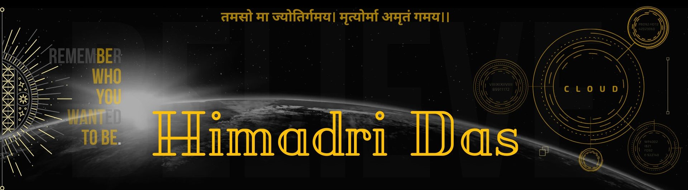

 <h2 align="center">Believes in Wanderlust + PB + Wheels 🏍 + Code = The Haven of My Heart</h2>

  
  

 <h2 align="center">Cloud & AI Enthusiast and Aspiring Technologist 🕵️‍♂️</h2>

### I'm an engineering student, a future developer 👨‍💻, and a technology enthusiast from India 🚩  who is passionate about Cloud Computing, Web Development and Google Cloud. I'm also an AI enthusiast, aspiring technologist, internet surfer 🏄‍♂️ and the potential it holds for shaping the future. I'm always eager to learn and collaborate, and I'm currently exploring ways to apply my skills and knowledge to solve real-world problems. I'm actively seeking opportunities to gain practical experience and contribute to meaningful projects.

### About me :eyes:

<!--- 🔭 I’m currently working on -->
- 🌱 I’m currently learning `Web Dev`.
- ❤️ My Love: `Cloud`
- 💬 Ask me about: Tech, Songs, Movies/Webseries
- 🥅 2024 Goals: Contribute more to Web Dev projects
- 👯 I’m looking to collaborate with new project ideas
- 📫 How to reach me: Links are given above 🔝
- 😄 Pronouns: He/Him
- ⚡ Languages: Python, C, C++, HTML, CSS, javascript, Node js, React js, Next.js
- 🤪 Fun fact: I'm not just a Coder, I'm a citizen of the world on Two Wheels. Fueled by Wanderlust and the thrill of Open Roads, I love Exploring new landscapes, Meeting Fascinating People, and pushing my Limits - both Physically and Technologically.

### My Experience 🎓
#### Current Roles 📢:
- 🥇 `Organizer` - GDG-On Campus, SNU (Sep 2024 - Present)
- 🥇 `Cloud Arcade Facilitator Cohort-1` - Google Cloud Skill Boost (April 2025 - Present)
- 🥇 `Microsoft Learn Beta Ambassador` (Dec 2023 - Present)
- 🥇 `Postman API Expert` (May 2023 - Present)
- 🥇 `Founder` - Pentaverse India (Dec 2023 - Present)
- 🥇 `Core Member` - GDG Cloud Kolkata (Feb 2023 - Present)
- 🥈 `Experienceed Editor` - Wikipedia (Sep 2023 - Present)
- 🥈 `Google Product Expert` (Dec 2022 - Present)
- 🥈 `Google Cloud Innovator` (Nov 2022 - Present)

#### Past Roles 📣:
- 🥇 `Cloud Arcade Facilitator` - Google Cloud (Jun 2024 - Sep 2024)
- 🥇 `GDSC Cloud Lead` - Google Developer Student Clubs (Aug 2023 - Sep 2024)
- 🥇 `Cloud Mentor` - Google Cloud Career Path (GCCP) (Nov 2022 - Feb 2023)
- 🥇 `Cloud Moderator` - Google Cloud Community Forum (GCCF) (Nov 2023 - Feb 2024)
- 🥉 Android Dev Intern - Oasis Infobyte (Sep 2023 - Oct 2023)
- 🥉 HR Intern - LearnX (Jul 2023 - Sep 2023)
- 🥉 Core Member - SKEPSIS (Sep 2023 - Aug 2024)
- 🥈 AI/ML Intern - AICTE NEAT (Jul 2022 - Sep 2022)

#### Community Engagement & Campus Ambassador 🎲:
- 🥈 Campus Ambassador - Multiple Tech Companies (2022 - Present)
  - Promoting tech tools and innovations across campuses for platforms like Coding Ninja, Internshala, HackerEarth, Yodaafy, and Zuno by Foundit.
- 🥈 Community Member - Various Tech Communities (2022 - Present)
  - Engaging, mentoring, and growing communities in Cloud, AI/ML, Web Development, and Programming. Member of communities such as Code8, GDG Kolkata, GDSC, Hack4Bengal, Newton School, Kotlin User Group Kolkata, Shardeum, etc.
- 🥉 Organizer & Volunteer for Campus and University Events (2023 - Present)

#### Achievements 🏆:
- 🎖️ `Excellent Innovation Award 2024` - Issued by AICTE, IIC (Institution’s Innovation Council), MoE's Innovation Cell, Udyog
  - Project: E-Vigil (Sister Nivedita University)
- 🎖️ `Innovative Excellence Award 2023` - Issued by AICTE, IIC (Institution’s Innovation Council), MoE's Innovation Cell, Udyog
  - Project: HelpLo (Sister Nivedita University)
- 🎖️ `Top 5 Team Award` - Issued by RISE Foundation IISER
  - Project: HelpLo (Ideapool Contest, Mar 2023)
- 🎖️ `Table Tennis State Semi-Finalist` - West Bengal Table Tennis Association
  - Event: West Bengal State & Inter District Table Tennis Championships 2013 (Dec 2013)
- 🎖️ `Table Tennis District Runners-Up` - West Bengal Table Tennis Association
  - Event: West Bengal State & Inter District Table Tennis Championships 2012 (Oct 2012)

### 🛠️ My Skills

#### 👉 Programming languages

 
  &emsp; 
   
&emsp; 
  
  &emsp;
	
  
  &emsp;
  
  &emsp;
   

#### 👉 Development

 
 &emsp;
   
  &emsp; 
   
 &emsp;
  
 &emsp;
   

 #### 👉 Software & Tools
 

  &emsp;
    
  &emsp;
    
  &emsp;
    
  &emsp;
    
  &emsp;
    
  &emsp;
    

 #### 👉 IDEs
 

	&emsp;
    
	&emsp;
    
	&emsp;
    

<!--- #### 👉 Competitive Programming & Problem Solving
 

  &emsp;
    

  --->

 #### 👉 Operating Systems
 

  &emsp;
    
  &emsp;
    
  &emsp;
     

 

### Languages and Tools :computer:

<code></code>
<code></code>
<code></code>
<code></code>
<code></code>

<a href="https://cloud.google.com" target="_blank" rel="noreferrer">  

 

### ⚡ My Github Stats

	
  

<a href="https://github.com/Himadri8991">  
	<!--img src="https://github-readme-stats.vercel.app/api?username=Himadri8991&show_icons=true&hide_border=true&count_private=true"-->
	
</a>

  

 
 

<!--footer-->

  

 

##
 <em><b>✈️ Passport in hand, code in my heart, I'm always ready to connect with tech trailblazers from every time zone! 🌏 so if you want to be my friend or want to share your coding adventures, feel free to ping me on [LinkedIn](https://www.linkedin.com/in/himadri-das-27487324a) and introduce yourself (But ditch the generic"hi" and, tell me about yourself or the projects that fuel your fire.</b> 😊 💜</em>

